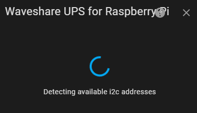
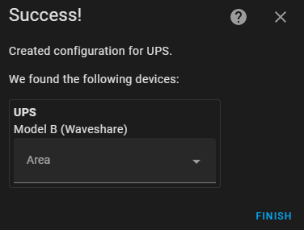
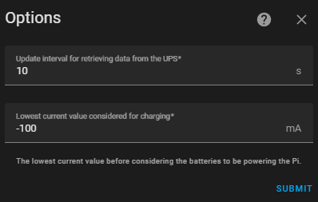

# Waveshare UPS for Raspberry Pi

Home Assistant integration for the Waveshare UPS for Raspberry Pi.

## Description

This integration can be used to get information over i2c for the
Waveshare UPS for the Raspberry Pi.

### Entities Provided

#### Binary Sensors

* Battery State - whether the battery is charging or not.

#### Sensors

* Battery Level - percentage of power left in the battery
* Current
* Load Voltage - the voltage on V- (load side)
* Power
* PSU Voltage - Load Voltage + Shunt Voltage
* Shunt Voltage - voltage between V+ and V- across the shunt

## Setup

### `Add Integration` button

Clicking the `Add Integration` button will cause the integration to start
looking for available devices on i2c.

Once the detection process has finished the following information will be
required.

* Name - friendly name for the configuration entry
* Address of the HAT - if only a single address was found it will be selected.
If multiple addresses are found the first is selected and you'll need to pick
the correct one to use.
* Version of the HAT - defaults to B. You should pick the version that you have.
* Update interval - defaults to 10s. Defines how often to query the UPS.

On successful set up the following screen will be seen detailing the device.

## Configurable Options

It is possible to configure the following options for the integration.

* Update interval - defaults to 10s. Defines how often to query the UPS.
* Mimimum current value for charging - defaults to -100mA. In my usage I've
found that whilst the documentation for the HAT states a negative current
means that the Pi is being powered by the batteries it can drop below 0 on
normal use. This value allows you to mitigate this.
